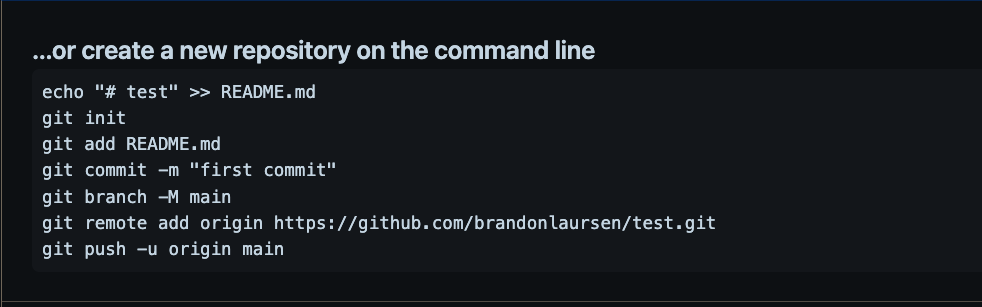

# Git Flow

## Creating repo on github
- Create new repo on github
- Select owner and give repo a name
- Make repo private
- Click create repo

## Create a local copy of the project
- `cd` into the directory you want the project to be in
ex: `cd app-academy`
- Copy the `npx tiged` command
-  ex:
```
npx tiged https://github.com/appacademy/aa02-advanced-array#full-time aa02-advanced-array
```
- Copy paste the `npx tiged` command into the terminal
- `cd` into the newly created directory
  - ex: `cd aa02-advanced-array`
  - Confirm with you're in the file with `ls`
    - You should see the `package.json`, `problems`, and test `directory`
- Open up the project using `code .`
- Inside the directory; create `.gitignore`
  - `touch .gitignore`
  - or right-click and create new file
- Inside the `.gitignore` add the line
  - `/node_modules`
  * If it doesnt get ignored; can also try
  `node_modules` or `node_modules/`
- run `npm install`
## Connect the repo to github
- Copy paste the commands from github
 
### Alternative
Do if you decide not to copy paste commands
- `git init`
- `git add README.md`
- `git commit -m "first commit"`
- `git branch -M main`
- ```git remote add origin https://github.com/brandonlaursen/array-methods-demo.git```
  - Note: replace with your url from github
- `git push -u origin main`

After copy pasting the commands, Push up files to the repo
- `git add .`
- `git commit -m ‘message’`
- `git push`

## Share with partner
- Click settings
- Click collaborators
- Click add people
- Enter your pairs github user name

## Partner
- Check email or github notifications
- Accept invite
- `cd` into the directory you want the project to be in
  - ex: `cd app-academy`
- `git clone` the repo link
  - ex: `git clone <replace-with-repo-link>`
- run `npm install`

## Git flow
Anytime you make changes and want to swap driver and navigator roles
- `git add .`
- `git commit -m ‘message’`
- `git push`

## Pair
- `git pull`


You will run into a git conflict if both collaborators work on the project as the same time. Only the driver should be working in the project till roles are swapped.

## If you get this error:
```
Please commit your changes or stash them before you merge.
```
- `git stash && git pull`
